# Finance Revenue Analytics using Snowflake, dbt and Tableau

## Project Overview

This project demonstrates an end-to-end Analytics Engineering workflow using Snowflake, dbt, and Tableau.

The objective is to transform raw e-commerce transactional data into a curated analytics layer that enables business reporting, KPI monitoring, and executive dashboards.

The project follows modern data engineering and analytics engineering best practices including:

* Source modeling
* Staging transformations
* Dimensional modeling
* Fact tables
* Reporting layer creation
* Data quality testing
* Lineage tracking
* Dashboard development

---

## Business Problem

Organizations generate large volumes of transactional data but often lack a trusted analytics layer that can provide accurate business insights.

This project addresses that challenge by building a modern analytics platform that:

* Centralizes business metrics
* Provides executive-level KPI reporting
* Enables product and revenue analysis
* Supports payment and customer behavior analysis
* Delivers trusted reporting datasets for business users

---

## Tech Stack

| Technology     | Purpose                              |
| -------------- | ------------------------------------ |
| Snowflake      | Cloud Data Warehouse                 |
| dbt Cloud      | Data Transformation & Modeling       |
| SQL            | Data Transformation Logic            |
| Tableau Public | Dashboard & Visualization            |
| GitHub         | Version Control & Portfolio Showcase |

---

## Architecture

The architecture follows a layered analytics engineering design pattern.

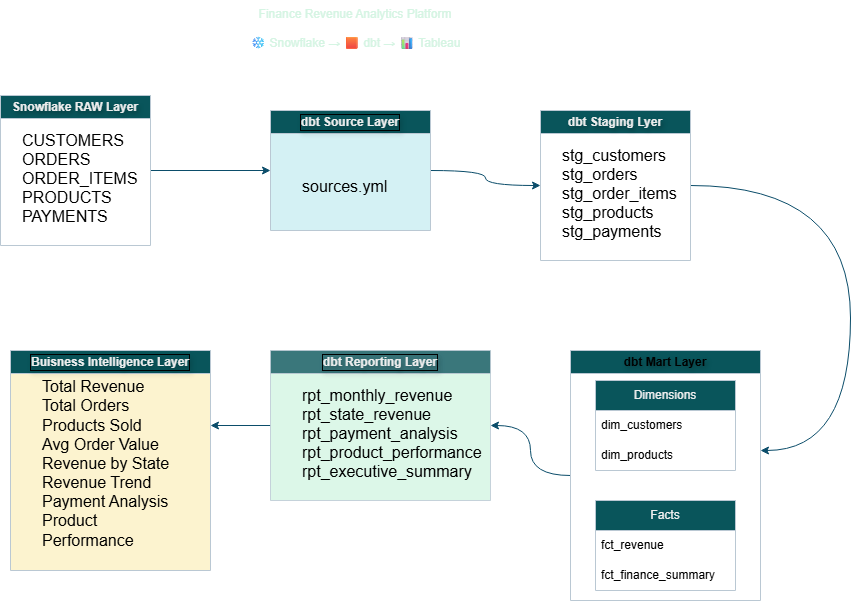

---

## Data Model

### Raw Layer

Source tables loaded into Snowflake:

* customers
* orders
* order_items
* products
* payments

### Staging Layer

* stg_customers
* stg_orders
* stg_order_items
* stg_products
* stg_payments

### Mart Layer

#### Dimensions

* dim_customers
* dim_products

#### Facts

* fct_revenue
* fct_finance_summary

### Reporting Layer

* rpt_monthly_revenue
* rpt_state_revenue
* rpt_payment_analysis
* rpt_product_performance
* rpt_executive_summary

---

## Executive KPIs

The project produces executive-level KPIs including:

| KPI                  | Value   |
| -------------------- | ------- |
| Total Revenue        | €20.3M  |
| Total Orders         | 98,666  |
| Products Sold        | 117,604 |
| Average Order Value  | €172.69 |
| Revenue Per Customer | €205.83 |

---

## Data Quality Testing

Implemented dbt tests:

* Not Null Tests
* Unique Tests
* Source Validation
* Relationship Validation

All tests successfully passed.

---

## dbt Lineage

The project uses dbt lineage to track dependencies from source systems through staging, marts, reporting models, and executive KPI outputs.

### Initial Project Lineage

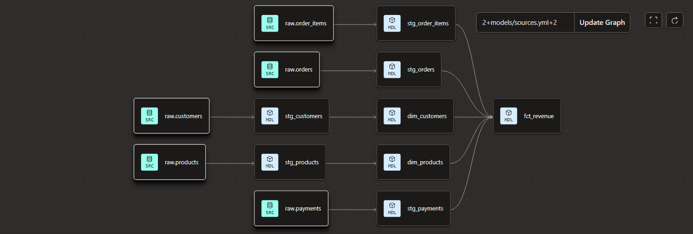

### Executive Summary Lineage

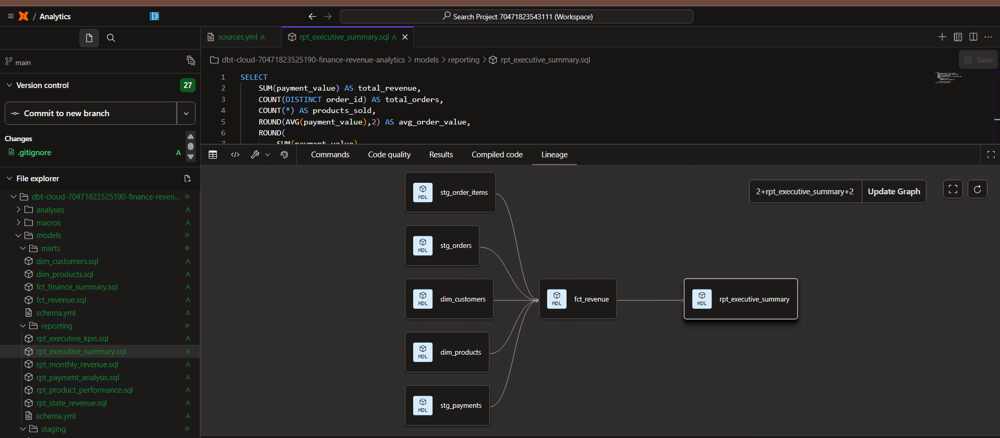

---

## Snowflake Source Tables

The following screenshot shows the raw source tables used within Snowflake.

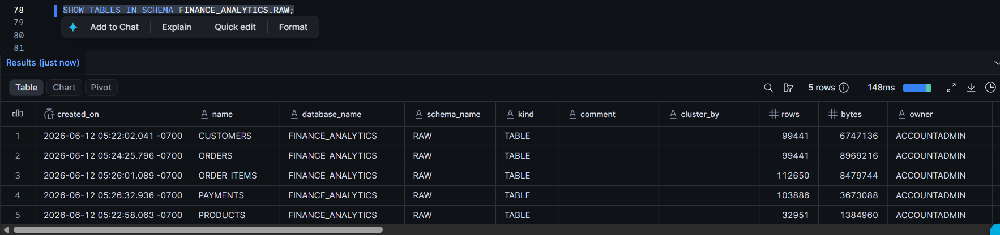

---

## Source Configuration

Source definitions are configured through dbt using `sources.yml`.

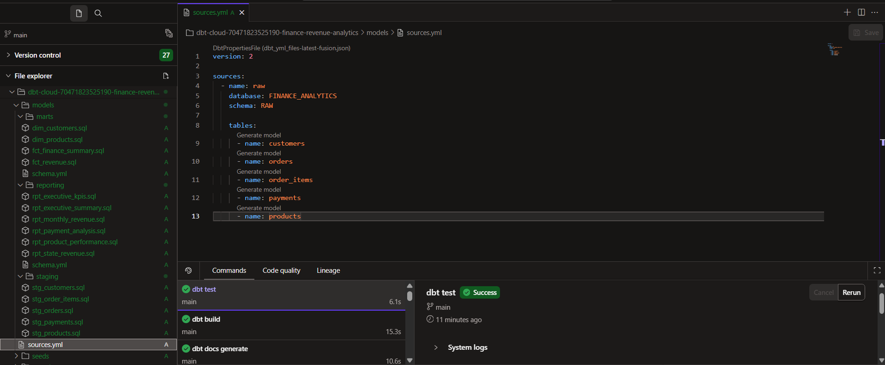

---

## Fact Model

Core revenue and finance metrics are generated using the fact model layer.

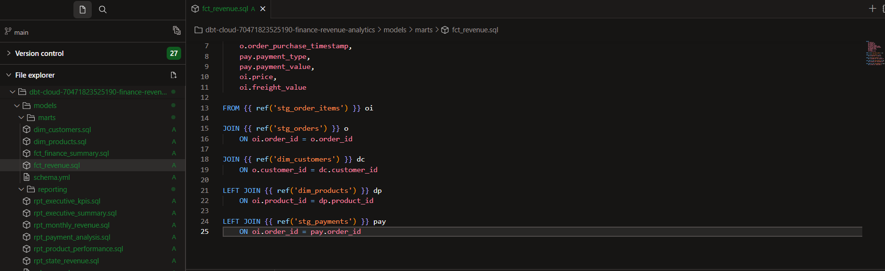

---

## dbt Build Results

Successful dbt model execution.

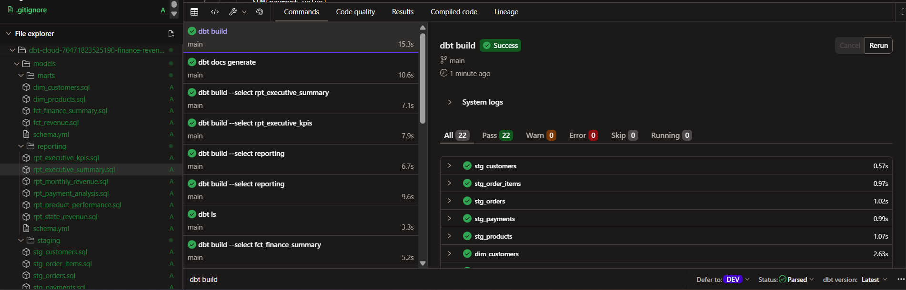

---

## dbt Test Results

Successful completion of data quality tests.

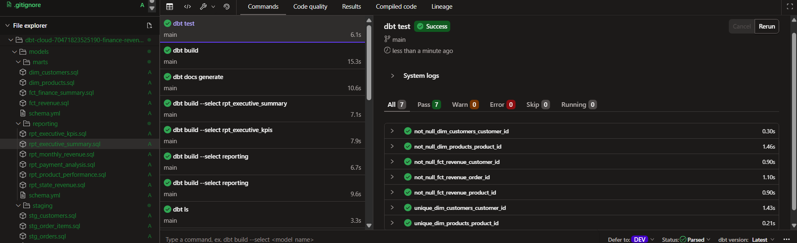

---

## Executive KPI Output

The executive KPI reporting model generates consolidated business metrics used by leadership and stakeholders.

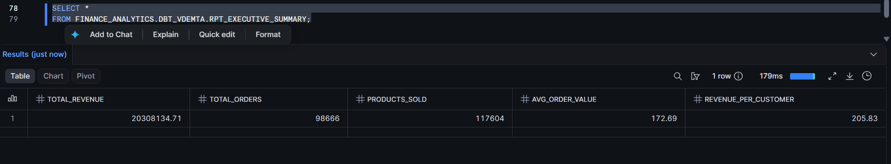

---

## Tableau Dashboard

The final Tableau dashboard includes:

* Total Revenue KPI
* Total Orders KPI
* Products Sold KPI
* Average Order Value KPI
* Revenue by State
* Monthly Revenue Trend
* Payment Method Analysis
* Product Category Performance

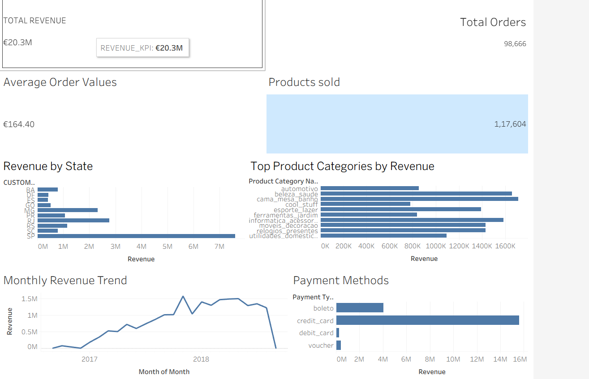

---

## Project Structure

The project follows a modular dbt architecture with separate staging, mart, and reporting layers.

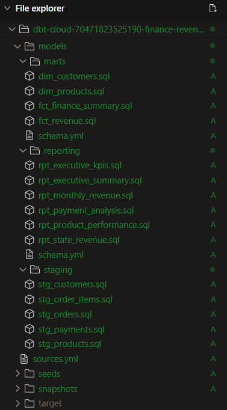

---

## Key Business Insights

### Revenue Concentration

A significant portion of total revenue originates from a limited number of states, enabling targeted market expansion strategies.

### Payment Analysis

Credit card transactions contribute the largest share of revenue across all payment methods.

### Product Performance

Certain product categories consistently outperform others and act as primary revenue drivers.

### Revenue Trend

Monthly revenue demonstrates a strong upward trend throughout the reporting period.

---

## Skills Demonstrated

* Analytics Engineering
* Data Modeling
* Dimensional Modeling
* SQL Development
* Snowflake
* dbt
* Data Quality Testing
* Business Intelligence
* Tableau Dashboarding
* Data Lineage
* Git & GitHub
* Technical Documentation

---

## Author

**Varul Demta**

Analytics Engineering Portfolio Project

Snowflake | dbt | SQL | Tableau
